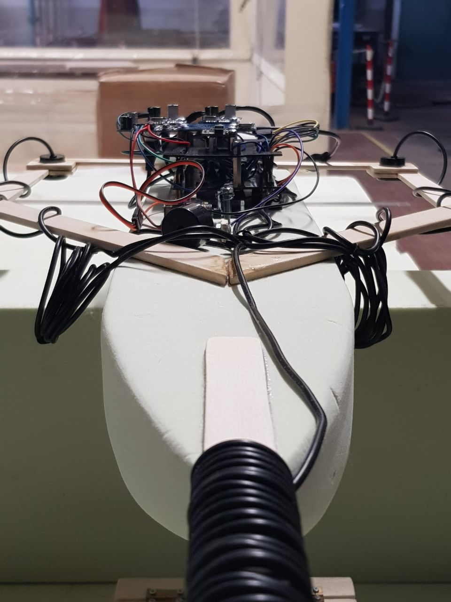
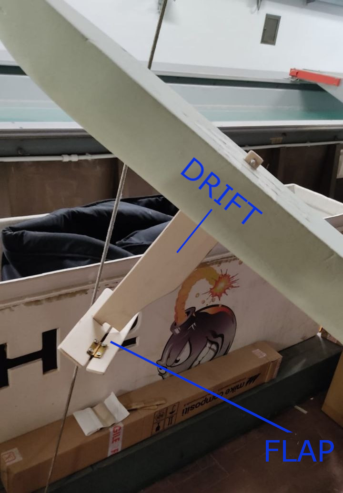
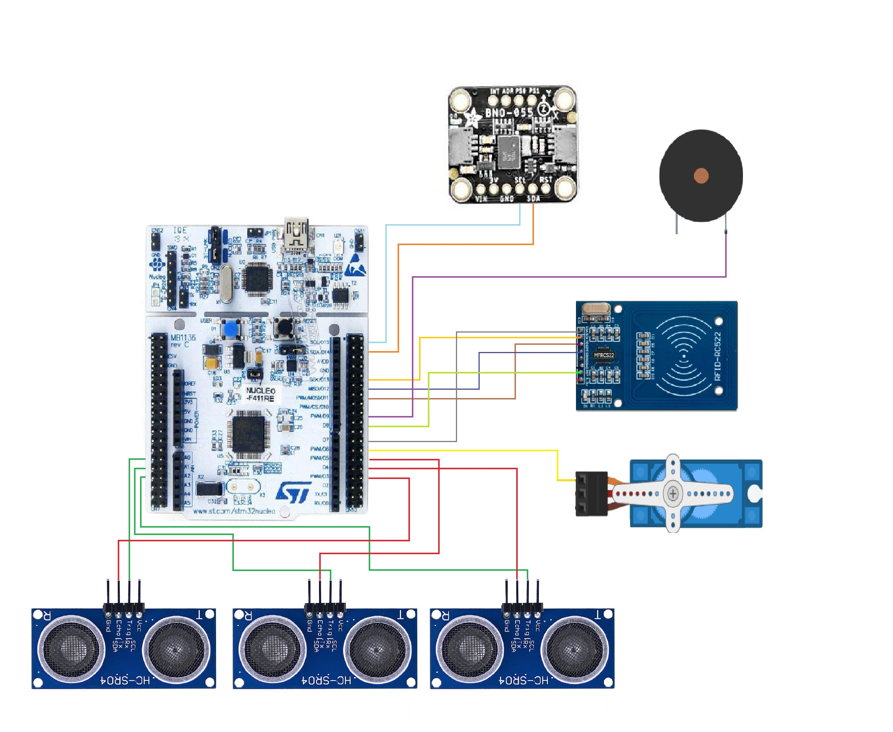
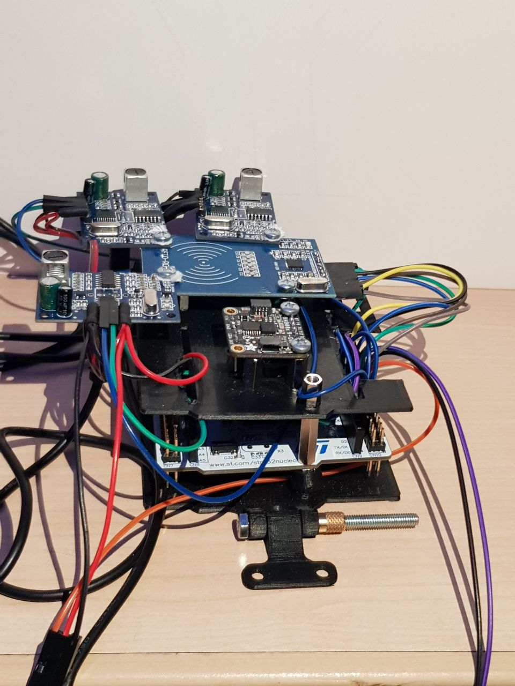
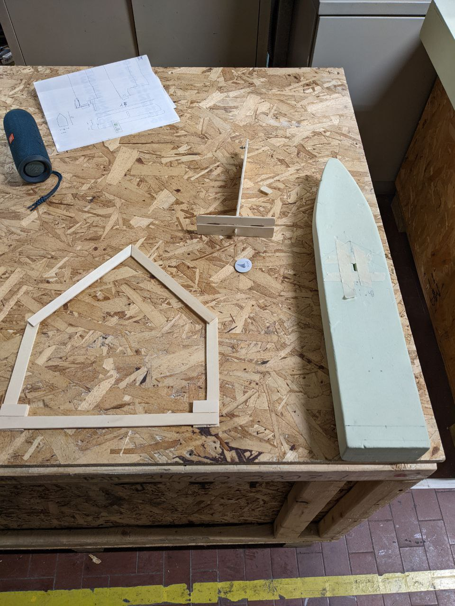
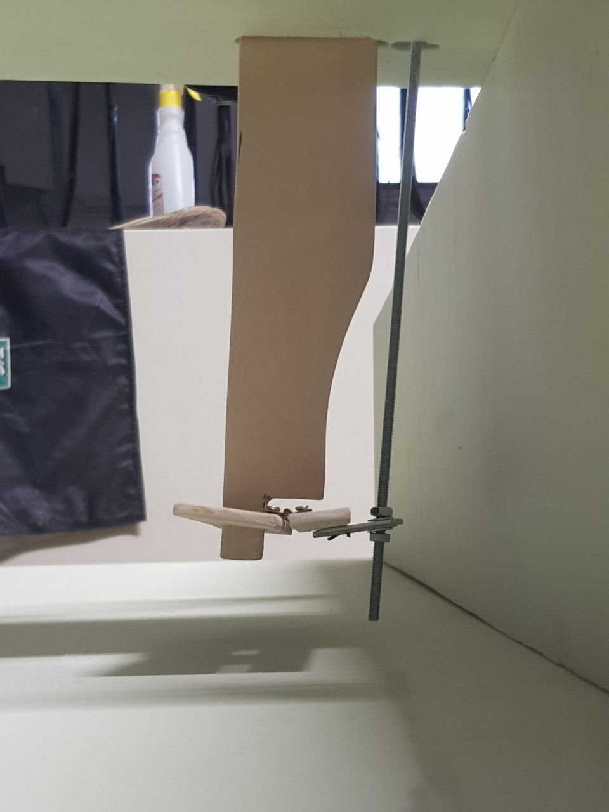
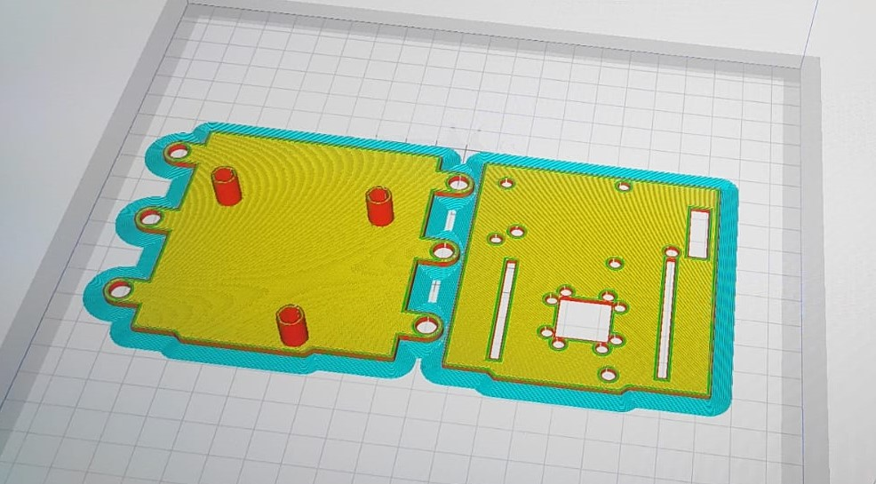
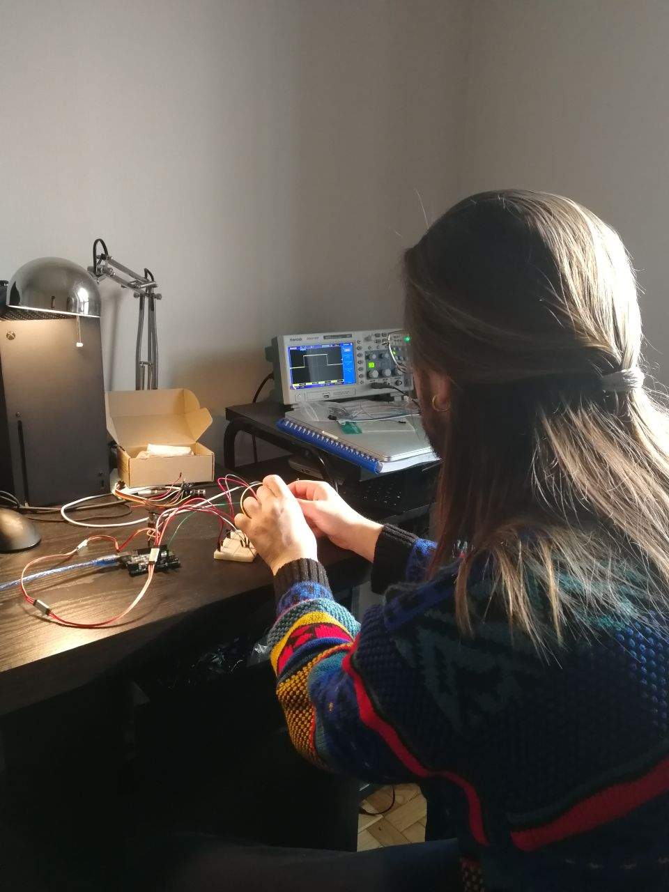
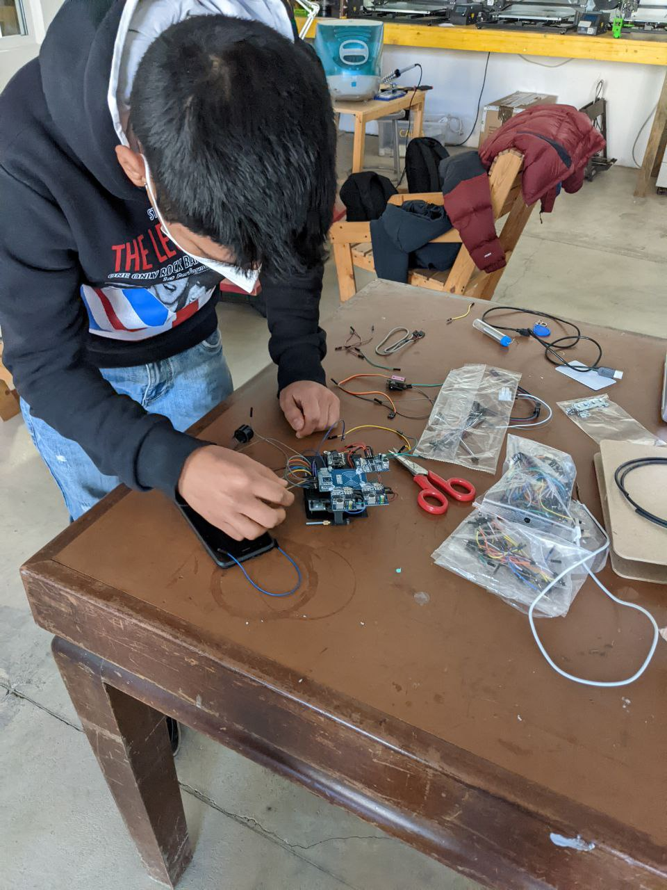
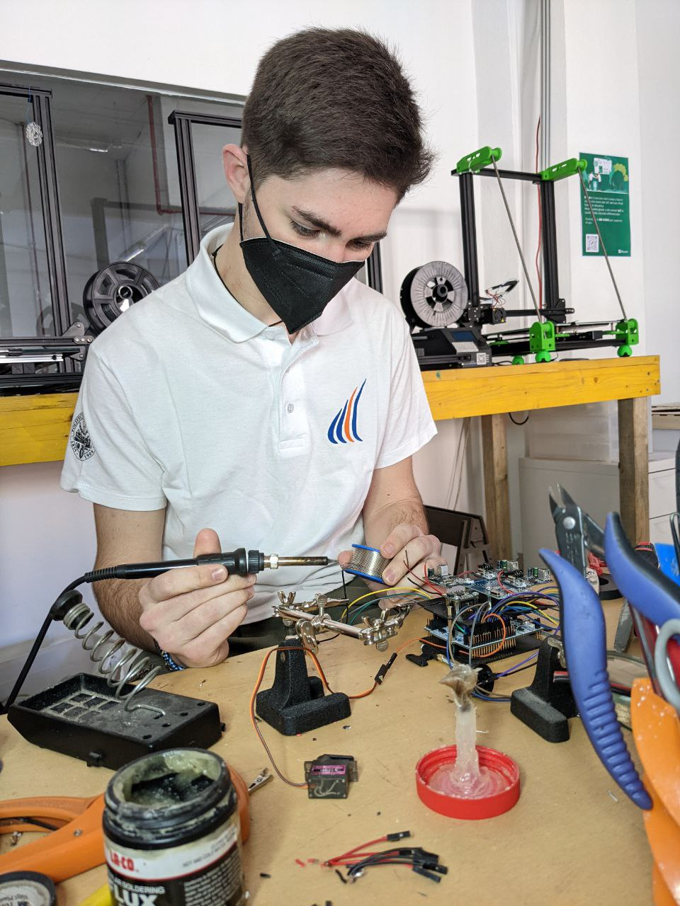

<div id="top"></div>
<!--
*** Thanks for checking out the Best-README-Template. If you have a suggestion
*** that would make this better, please fork the repo and create a pull request
*** or simply open an issue with the tag "enhancement".
*** Don't forget to give the project a star!
*** Thanks again! Now go create something AMAZING! :D
-->


<!-- PROJECT SHIELDS -->
<!--
*** I'm using markdown "reference style" links for readability.
*** Reference links are enclosed in brackets [ ] instead of parentheses ( ).
*** See the bottom of this document for the declaration of the reference variables
*** for contributors-url, forks-url, etc. This is an optional, concise syntax you may use.
*** https://www.markdownguide.org/basic-syntax/#reference-style-links
-->
[![Contributors][contributors-shield]][contributors-url]
[![Forks][forks-shield]][forks-url]
[![Stargazers][stars-shield]][stars-url]
[![Issues][issues-shield]][issues-url]
[![MIT License][license-shield]][license-url]


<!-- PROJECT LOGO -->
<br />
<div align="center">

<h3 align="center">MFCS21</h3>

  <p align="center">
    Electronic flight control system for the moth class sailboat to be mounted on a skiff developed by Polito Sailing Team
    <br />
    <a href="https://github.com/SoC-Arch-polito/mfcs21"><strong>Explore the docs »</strong></a>
    <br />
    <br />
    <a href="https://github.com/SoC-Arch-polito/mfcs21/issues">Report Bug</a>
    ·
    <a href="https://github.com/SoC-Arch-polito/mfcs21/issues">Request Feature</a>
  </p>
</div>


<!-- TABLE OF CONTENTS -->
<details>
  <summary>Table of Contents</summary>
  <ol>
    <li>
      <a href="#about-the-project">About The Project</a>
      <ul>
        <li><a href="#built-with">Built With</a></li>
      </ul>
    </li>
    <li>
      <a href="#getting-started">Getting Started</a>
      <ul>
        <li><a href="#prerequisites">Prerequisites</a></li>
        <li><a href="#installation">Installation</a></li>
      </ul>
    </li>
    <li><a href="#usage">Usage</a></li>
    <li><a href="#contributing">Contributing</a></li>
    <li><a href="#license">License</a></li>
    <li><a href="#contact">Contact</a></li>
    <li><a href="#acknowledgments">Acknowledgments</a></li>
  </ol>
</details>


<!-- ABOUT THE PROJECT -->
## About The Project

[](https://github.com/SoC-Arch-polito/mfcs21)

<p align="right">(<a href="#top">back to top</a>)</p>


### Built With

* [STM32F4xx](https://www.st.com/en/microcontrollers-microprocessors/stm32f4-series.html)
* [Arduino](https://www.arduino.cc/)

<p align="right">(<a href="#top">back to top</a>)</p>


### Functional Specification

This project aims at automatically regulate and control the height of the flight of a <a href="#moth">Moth</a>.<br>
Commercial products use mechanical elements to change the angle of the flap mounted below the drift, while the one on the rudder is directly regulated by the sailor. Our goal is to avoid the mechanical "measurement" of the height, using both ultrasonic sensors and an <a href="imu">IMU</a>, and automatically derive the right angle the foil must assume according to that.<br>
In particular, our sensing system is composed of 3 ultrasonic sensors mounted one at the bow, and the other two at stern, to the left and right extremes of the skiff, and the IMU, that allows us to retrieve the spatial orientation of the boat. Taking into account the pitch and roll angles, we can properly weight the measured distances and find the height of the center of gravity of the boat.<br>
First of all some offsets have been added to the ultrasonic measures to consider the boat as a flat surface on which the sensor are mounted, independently of the real position of the sensors on the z axis.<br>
Then, the following offsets have been taken into account to retrieve the impact of the orientation of the boat on each measured data:


The output of the system is the angle the flap must assume in order to reach and maintain the TARGET height.<br>
This has been obtained using two different PIDs, a more aggressive one, to quickly reach the target, and a conservative one, to smootly maintain the height.
The change between the two depends on the absolute difference from the target height: if this is above a defined THRESHOLD, we are using the first, otherwise we are using the second.<br>
TARGET and THRESHOLD are then selected by the sailor between 3 different options for each parameter, just by approaching one of the two RFID cards to the reader.

<hr>
<div id="moth">The Moth is a small sailing boat designed to plane; since 2000 it has become an expensive and largely commercially-produced class of boat designed to hydroplane on foils.</div>
<p align="middle">
  
  
</p>
<div id="imu">IMU stands for Inertial Measurement Unit, and is an electronic device that measures and reports a body's specific force, angular rate and orientation of the body, using a combination of accelerometers, gyroscopes, and sometimes magnetometers.</div>
<p align="right">(Wikipedia)</p>

<!-- GETTING STARTED -->
## Getting Started

### Prerequisites

*	STM32F4xx microcontroller
*	3 HC-SR04 waterproof ultrasonic sensors
*	BNO085 IMU
*	MFRC522 RFID reader
*	servomotor (torque to be calculated according to flap and skiff dimensions/profile)
<br>
Follow the schematic below to setup the system:
<br> 




### Installation

1. Clone the repo
   ```sh
   git clone https://github.com/SoC-Arch-polito/mfcs21.git
   ```
2. Copy all the libraries contained in <a href="libraries">libraries</a> in your respective Arduino folder
3. Compile the <a href="src/stm32INOsketch/stm32INOsketch.ino">stm32INOsketch</a> and upload it on the board

<p align="right">(<a href="#top">back to top</a>)</p>


<!-- USAGE EXAMPLES -->
## Usage

Power on the device, calibrate the IMU, by performing the usual 8 in air around all the 3 different axes (a buzzer sound will let you know when the calibration is done) and mount everything in place.
Use the wanted RFID card to change either the target height or the sensibility of the system (when to perform the switch between the two PID networks); click <a href="videos/simulation_test.mp4">here</a> for a quick demo.
An example of how the system works and ties to maintain a certain target height is provided <a href="videos/parameter_change.mp4">here</a>.

<p align="right">(<a href="#top">back to top</a>)</p>

<!-- Physical system and model building -->
### Physical system and model building

Below you can find some images documenting the different phases of work followed to build the entire system.








<!-- CONTRIBUTING -->
## Contributing

Contributions are what make the open source community such an amazing place to learn, inspire, and create. Any contributions you make are **greatly appreciated**.

If you have a suggestion that would make this better, please fork the repo and create a pull request. You can also simply open an issue with the tag "enhancement".
Don't forget to give the project a star! Thanks again!

1. Fork the Project
2. Create your Feature Branch (`git checkout -b feature/AmazingFeature`)
3. Commit your Changes (`git commit -m 'Add some AmazingFeature'`)
4. Push to the Branch (`git push origin feature/AmazingFeature`)
5. Open a Pull Request

<p align="right">(<a href="#top">back to top</a>)</p>


<!-- LICENSE -->
## License

Distributed under the MIT License. See [LICENCE](LICENCE.txt) for more information.

<p align="right">(<a href="#top">back to top</a>)</p>


<!-- CONTACT -->
## Contact

Luca Dalmasso, Omar Gai, Alessandro Landra

Project Link: [https://github.com/SoC-Arch-polito/mfcs21](https://github.com/SoC-Arch-polito/mfcs21)

<p align="right">(<a href="#top">back to top</a>)</p>


<!-- ACKNOWLEDGMENTS -->
## Acknowledgments

* [PolitoSailingTeam](https://areeweb.polito.it/politosailingteam/)

<p align="right">(<a href="#top">back to top</a>)</p>


<!-- MARKDOWN LINKS & IMAGES -->
<!-- https://www.markdownguide.org/basic-syntax/#reference-style-links -->
[contributors-shield]: https://img.shields.io/github/contributors/SoC-Arch-polito/mfcs21.svg?style=for-the-badge
[contributors-url]: https://github.com/SoC-Arch-polito/mfcs21/graphs/contributors
[forks-shield]: https://img.shields.io/github/forks/SoC-Arch-polito/mfcs21.svg?style=for-the-badge
[forks-url]: https://github.com/SoC-Arch-polito/mfcs21/network/members
[stars-shield]: https://img.shields.io/github/stars/SoC-Arch-polito/mfcs21.svg?style=for-the-badge
[stars-url]: https://github.com/SoC-Arch-polito/mfcs21/stargazers
[issues-shield]: https://img.shields.io/github/issues/SoC-Arch-polito/mfcs21.svg?style=for-the-badge
[issues-url]: https://github.com/SoC-Arch-polito/mfcs21/issues
[license-shield]: https://img.shields.io/github/license/SoC-Arch-polito/mfcs21.svg?style=for-the-badge
[license-url]: https://github.com/SoC-Arch-polito/mfcs21/blob/master/LICENSE.txt